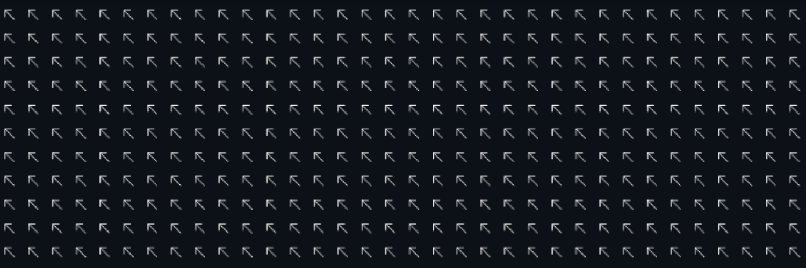

# Motion Displayer Application

Block Matching Algorithms and motion estimation are an important concept that serve an essential purpose for video compression on many video hosting/viewing services on the internet. With this in mind I have decided to create an application that allows the user to visualise the frame-by-frame changes by drawing motion vectors within each macro block of a given video. Users have the ability to modify the search size and block size to their choosing or opt for the standard sizing. User interaction is facilitated by a UI composed of three stages - picking the file, configuring the setting and processing the file. The result is a copy of the original with motion vectors draw on each frame according to their selected configuration and inter-frame changes.  

https://user-images.githubusercontent.com/52254823/142905291-55b3fac1-8f84-4e43-a389-900c894ea776.mp4

*See [`bear_out.mp4`](documentation_sources/bear_out.mp4) as example of output. Not embedding due to compression algorithm ruining quality.*

# Methodologies:

This application has two core modules to it and furthermore relies on two platforms in order to function. Firstly the view module is responsible for drawing the UI, handling all user interaction and for starting backend processes to handle video files. In order to draw the UI I am using [JavaFX](https://openjfx.io/) which provides powerful features to change scenes, adapt according to user input, etc. The second module as part of this application is the model module. This part of the application is responsible to processing video files specifically calculating motion vectors for each block that is part of a frame and each frame that is part of the supplied video. For video processing I am using [OpenCV](https://opencv.org/) which allows for the extraction of frames, modification of frames and building of new videos among more. Since within a single 1920x1080 frame there can be as many as 8040 search areas and within each search area 81 block areas to calculate and minimise, this application relies on multithreading to process each search area in a parallel fashion waiting for all threads to complete before adding the modified frame to the output and then moving onto process the next frame. 

In order to create an executable I am using [Launcher4J.](http://launch4j.sourceforge.net/)

# Status

**The executable can only be run on Windows 10 64 bit.** You can [download the executable here](https://rhodrithomasmorgan.com/motion_displayer/) otherwise [clone repository including git lfs files](JRE_DOWNLOAD.md) and run `Motion Displayer.exe`. Do not delete any files.
