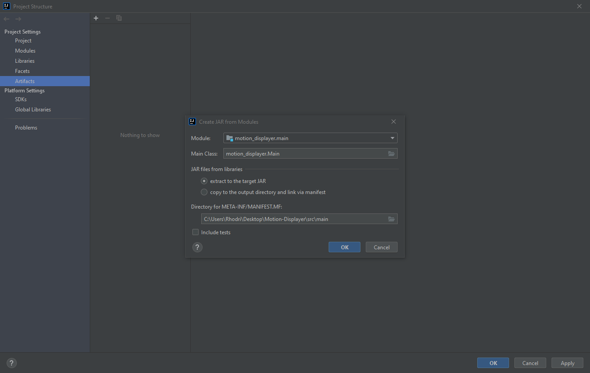
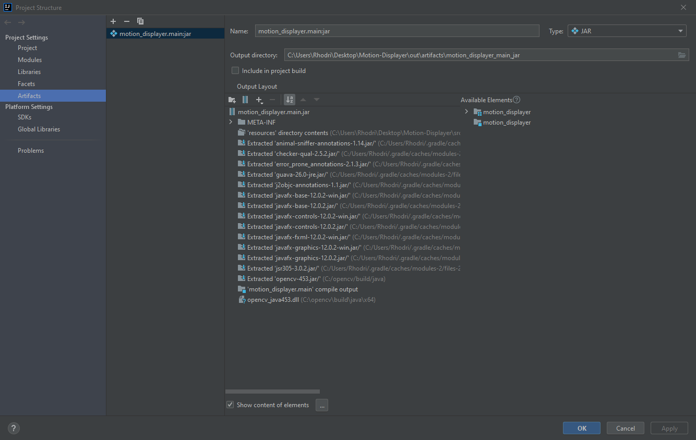

# Motion Displayer Application

*See [BACKGROUND.MD](BACKGROUND.md) for example, motivation, data sources and methodology.*

## Java and Dependencies

### Java Version

This project is using `java version 11.0.10`.

### Gradle Version

This project is using `Gradle 5.0`.

### Dependencies

* This project requires `OpenCV 4.5.3` for Java. Instructions for setup with Gradle and IDEA can be found [here](https://www.pisciottablog.com/2021/03/02/use-opencv-in-a-gradle-project-using-intellij-idea-community-edition-for-java-in-windows-10/).

* This project requires `JavaFX 12.0.2`. Instructions for setup with Gradle and IDEA can be found [here](https://openjfx.io/openjfx-docs/#gradle).

## Building Jar and Exe

### Jar

In IntelliJ IDEA `File -> Project Structure -> Artifacts -> Add JAR from modules with dependencies` and follow the images below.

**Ensure `opencv_java453.dll` is added manually.**

Then proceed to `Build -> Build Artifacts`. Output should be located at `out/artifacts/motion_displayer_main_jar`.

### Exe

Utilising Launch4J follow [this video](https://www.youtube.com/watch?v=h68WlAn_Vfg) on how to generate EXE. Use `jdk-11.0.10` instead of JRE as suggested in video.

There is an existing config file `launcher4j_config`.

## Running Executable

**The executable can only be run on Windows 10 64 bit.** You can [download the executable here](https://rhodrithomasmorgan.com/motion_displayer/) otherwise [clone the repository including git lfs files](JRE_DOWNLOAD.md) and run `Motion Displayer.exe`. Do not delete any files.
